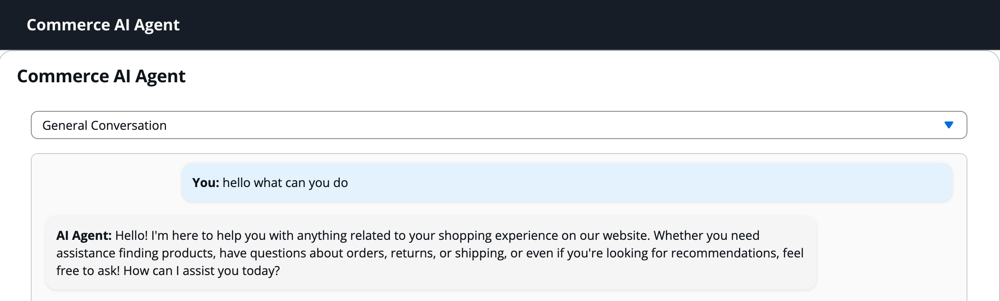
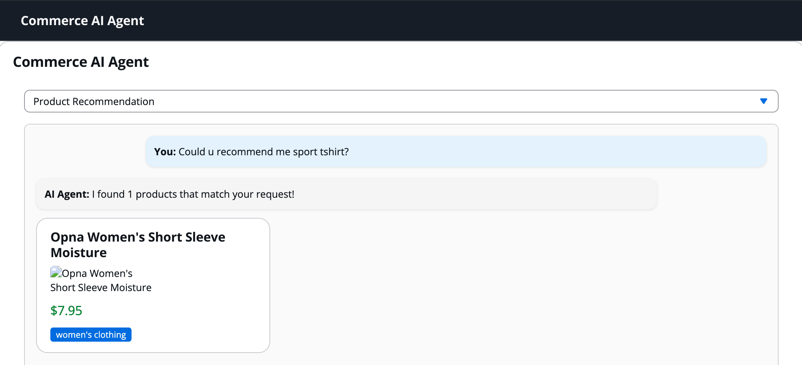
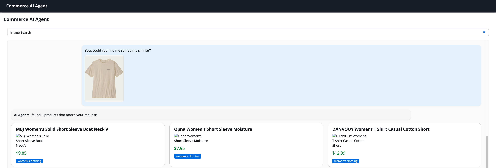

# Commerce AI Agent

A full-stack AI-powered conversational agent for e-commerce product recommendations and search. Built with React TypeScript frontend and FastAPI Python backend.

## Live Demo

**Frontend**: http://54.203.168.238:3000/
**Backend API**: http://54.203.168.238:8000/
**API Documentation**: http://54.203.168.238:8000/docs#/

## Features

- **General Conversation**: Chat naturally with the AI assistant

- **Text-based Product Search**: Get recommendations from text queries like "I need a sports t-shirt"

- **Image-based Product Search**: Upload images to find similar products

- **Responsive Design**: Works perfectly on desktop, tablet, and mobile
- **Real-time Chat**: Auto-scrolling chat interface with loading states
- **Professional UI**: Built with AWS Cloudscape Design System

## Beyond the scope
- **Image Hosting**: Product images from fakestoreapi.com may not load on EC2 due to CORS/Cloudflare restrictions.
- **Static Catalog**: Uses a dummy product source (https://fakestoreapi.com/products); no dynamic inventory.

## Architecture
### Frontend
- **React 18** with TypeScript
- **AWS Cloudscape** Design System
- **Axios** for API calls
- **Serve** for production deployment

### Backend
- **FastAPI** with Python 3.11
- **OpenAI GPT-4o** for conversations and image analysis
- **Pydantic** for data validation
- **Local JSON data** for fast product lookup

## Quick Start

### Prerequisites
- Python 3.11+
- Node.js 18+
- OpenAI API key

### 3. Access the Application
- **Frontend**: http://localhost:3000
- **Backend API**: http://localhost:8000
- **API Docs**: http://localhost:8000/docs

## Development Setup
### Local Development
```bash
# Backend
git clone https://github.com/kerui1125/commerce-ai-agent.git
cd commerce-ai-agent

cd backend
python -m venv venv
source venv/bin/activate  # On Windows: venv\Scripts\activate
pip install -r requirements.txt
touch /backend/.env
echo "OPENAI_API_KEY=<your_key_here>" > .env
uvicorn app.main:app --reload

# Frontend (in another terminal)
cd frontend
npm install
npm start
```
### AWS EC2 Developoment
```bash
git clone https://github.com/kerui1125/commerce-ai-agent.git
cd commerce-ai-agent
ls -la frontend/build/ # ec2 t2.micro has limit memory, so React app used optimized build solution to speed up the deployment
chmod +x simple-deploy.sh
./simple-deploy.sh
```
### Other Deployment Options
- **Frontend**: Netlify, Vercel (just upload the build folder)
- **Backend**: Railway, Render, Heroku
- **Full Stack**: DigitalOcean App Platform

## API Usage

### Chat Endpoint
```bash
curl -X POST "http://localhost:8000/api/chat" \
  -H "Content-Type: application/json" \
  -d '{
    "message": "I need a sports t-shirt",
    "type": "product_recommendation_text",
    "image": null
  }'
```

### Response Format
```json
{
  "response": "I found 3 products that match your request!",
  "products": [
    {
      "id": 1,
      "title": "Nike Dri-FIT Sports T-Shirt",
      "price": 29.99,
      "description": "Athletic shirt for sports",
      "category": "men's clothing",
      "image": "https://example.com/image.jpg",
      "rating": {"rate": 4.5, "count": 120},
      "tags": ["sports", "athletic", "nike"]
    }
  ]
}
```

## Performance

- **Local product data** for sub-100ms search responses
- **Async operations** for handling concurrent users
- **Optimized builds** for production
- **Static asset serving** with serve
- **Process management** with PM2

## Security

- **Environment variables** for sensitive data
- **CORS configuration** for cross-origin requests
- **Input validation** with Pydantic
- **Process isolation** with PM2

## Project Structure

```
commerce-ai-agent/
├── backend/
│   ├── app/
│   │   ├── data/products.json      # Product catalog
│   │   ├── models/                 # Pydantic models
│   │   ├── services/               # Business logic
│   │   └── main.py                 # FastAPI app
│   └── requirements.txt
├── frontend/
│   ├── src/
│   │   ├── components/SimpleChat.tsx
│   │   └── App.tsx
│   └── package.json
├── simple-deploy.sh               # EC2 deployment script
└── README.md
```
---
Built for modern e-commerce experiences